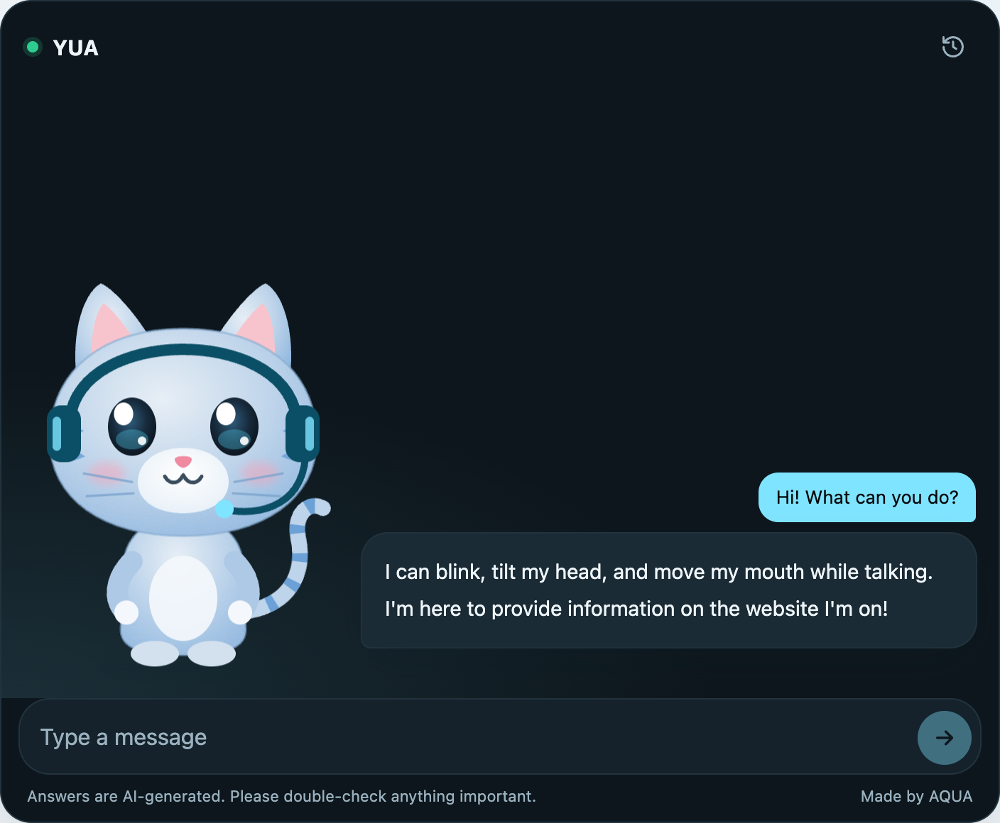
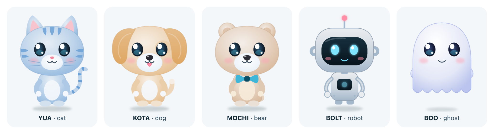

<div align="center">

# ai-mascot

**An animated AI character for any website — in one line of HTML.**

It blinks, tilts its head while thinking, and moves its mouth as the answer streams in.<br>
Bring your own model: **OpenAI, Claude, Gemini, or a free local Ollama.**

[日本語](#日本語) · [Quick start](#quick-start) · [Characters](#characters) · [Server](#server) · [Security](#security)



</div>

> **Status: v0.1.** The npm packages (`ai-mascot`, `ai-mascot-server`, `create-ai-mascot`) are being published. Until they are live, [run from source](#development) — the commands below will work as soon as they are.

## Quick start

**1. Run the server** (keeps your API key off the browser)

```bash
# free, local, no API key
ollama pull llama3.2
AI_MASCOT_PROVIDER=ollama npx ai-mascot-server

# or OpenAI / Claude / Gemini
OPENAI_API_KEY=sk-... npx ai-mascot-server
```

**2. Add one line to your page**

```html
<script src="https://cdn.jsdelivr.net/npm/ai-mascot" data-endpoint="http://localhost:8787/api/chat"></script>
```

That's it. A cat appears in the corner. Click it and ask something.

## Options

Every option is an attribute — on the `<script>` tag as `data-*`, or on the element itself:

```html
<ai-mascot endpoint="/api/chat" color="#f2c6a0" accessory="headset" name="Miko" tone="genki"
           suggestions="Pricing?|Opening hours?|Where are you?"></ai-mascot>
```

| Attribute | Values | Default |
|---|---|---|
| `endpoint` | URL of your ai-mascot server | — (required) |
| `character` | `cat` `dog` `bear` `robot` `ghost` | `cat` |
| `color` | any hex color | `#a9c6e3` |
| `accessory` | `none` `headset` `coat` `bowtie` | `none` |
| `name` | 1–16 characters | the character's name |
| `tone` | `polite` `friendly` `genki` | `polite` |
| `lang` | `en` `ja` | browser language |
| `mode` | `floating` (corner button) / `inline` (fills its box) | `floating` |
| `position` | `right` `left` | `right` |
| `theme` | `auto` `light` `dark` | `auto` |
| `greeting`, `placeholder` | your own text | — |
| `suggestions` | quick questions, separated by `\|` | — |
| `credit` | `false` hides "Made by AQUA" | shown |

JavaScript API: `el.open()`, `el.close()`, `el.ask("text")`, and the `ai-mascot:reply` event.

## Characters



Every character takes any `color`. Outfits: `headset`, `coat` (doctor), `bowtie` (robot: bowtie, ghost: headset/bowtie).

A character is a function that returns SVG. The widget brings it to life by looking for a few class names — `.m-eye` (blink), `.m-eyes` (follow the pointer), `.m-mouth` / `.m-open` (talk), `.m-head` (tilt), `.m-tail`, `.m-ear`, `.m-wave`. See [`packages/widget/src/characters/types.ts`](packages/widget/src/characters/types.ts).

```js
import { registerCharacter } from 'ai-mascot';
registerCharacter(myDog);
```

**New characters are very welcome.** Dogs, robots, ghosts, your company's mascot — see [CONTRIBUTING.md](CONTRIBUTING.md).

## Answer from your website

Read your site once, and the mascot answers from its pages — and shows which page it used.

```bash
npx ai-mascot-server index https://your-site.example --out knowledge.json
AI_MASCOT_KNOWLEDGE=knowledge.json npx ai-mascot-server
```

It reads `sitemap.xml` (or follows links from the home page), keeps only the readable text, and searches it for every question. Works for English and Japanese with no extra setup.

## Set up in one minute

```bash
npx create-ai-mascot
```

Pick an AI, paste your key (it is saved only in `.env`), enter your site URL — done. You get a folder with `npm start` and `npm run index` ready to go.

## Server

`ai-mascot-server` is a tiny [Hono](https://hono.dev) app. Run it with `npx`, or mount it in your own app (Node, Cloudflare Workers, Vercel, Deno, Bun):

```ts
import { createMascotServer } from 'ai-mascot-server';

const app = createMascotServer({
  provider: 'anthropic',              // openai | anthropic | gemini | ollama | openai-compatible
  apiKey: process.env.ANTHROPIC_API_KEY,
  instructions: 'We are a bakery in Shinagawa. Open 8:00–18:00, closed Mondays.',
  allowedOrigins: ['https://your-site.example'],
});
export default app;
```

| Environment variable | Meaning |
|---|---|
| `AI_MASCOT_PROVIDER` | `openai` `anthropic` `gemini` `ollama` `openai-compatible` `mock` |
| `AI_MASCOT_MODEL` | model name (each provider has a sensible default) |
| `AI_MASCOT_API_KEY` | or `OPENAI_API_KEY` / `ANTHROPIC_API_KEY` / `GEMINI_API_KEY` |
| `AI_MASCOT_BASE_URL` | for OpenAI-compatible APIs (LM Studio, vLLM, OpenRouter…) |
| `AI_MASCOT_INSTRUCTIONS` / `_FILE` | facts about your site the mascot may use |
| `AI_MASCOT_KNOWLEDGE` | a file made by `ai-mascot-server index` |
| `AI_MASCOT_ORIGINS` | comma-separated sites allowed to call the server |
| `AI_MASCOT_NAME`, `PORT` | default name, port (8787) |

## Security

- API keys live only on the server. The browser never sees them.
- `allowedOrigins` blocks other sites from using your server. Set it before going live.
- Built-in rate limit: 20 requests / 10 minutes per IP (pass your own limiter for serverless).
- Conversations are not stored or logged.
- The mascot is told to answer only from your `instructions` and to say "I don't know" otherwise.

## Development

```bash
pnpm install
pnpm test
pnpm --filter ai-mascot-server dev   # server on :8787 (offline demo provider)
pnpm dev                             # playground on :5173
```

---

## 日本語

**どんなサイトにも、1行で置ける「動いてしゃべるAIキャラクター」です。**

まばたきをして、考えるときは首をかしげ、答えが流れてくるのに合わせて口が動きます。AIは OpenAI・Claude・Gemini、またはキーなし・無料で手元のPCで動く Ollama から選べます。

```html
<script src="https://cdn.jsdelivr.net/npm/ai-mascot" data-endpoint="/api/chat" data-name="ミケ" data-tone="friendly" data-lang="ja"></script>
```

- APIキーはサーバーにだけ置き、ブラウザには出しません。
- `instructions` に書いたサイトの情報だけをもとに答え、知らないことは「わからない」と答えます。
- 会話は保存しません。
- キャラクターは猫（YUA）・犬（KOTA）・クマ（MOCHI）・ロボット（BOLT）・おばけ（BOO）の5体。色は自由です。
- `npx ai-mascot-server index https://あなたのサイト` でサイトを読み込むと、そのページの内容から答え、参考にしたページも表示します。
- `npx create-ai-mascot` で、AIの選択・キーの保存・サイトの読み込みまで1分で準備できます。
- キャラクターは誰でも追加できます。[CONTRIBUTING.md](CONTRIBUTING.md) をご覧ください。

### 会社だけのオリジナルキャラクターを作りたい方へ

このライブラリは無料（MIT）です。会社のためのオリジナルキャラクターのデザイン、設置・運用、会社の情報の整理は、作者の [AQUA合同会社](https://www.aquallc.jp/hp/)（東京・品川）が承っています。

## License

MIT © 2026 AQUA LLC (YUA LAB)
